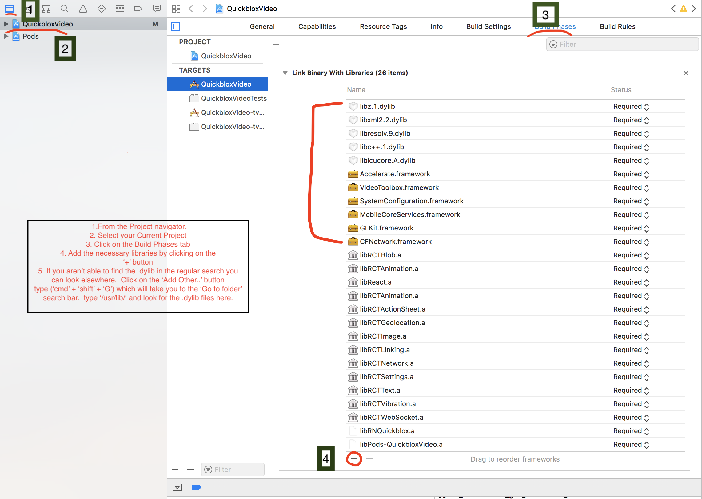
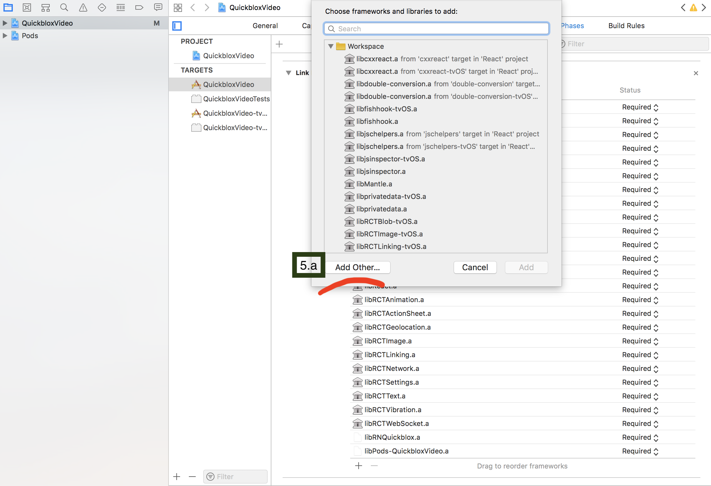
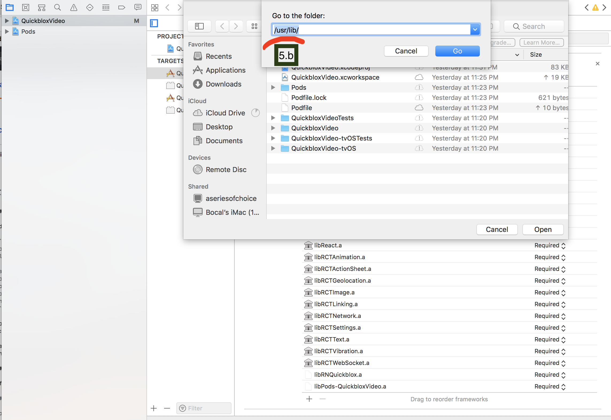
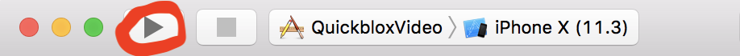

# RN-Quickblox

Because there is a lack of Quickblox in the React Native world. :(

## Setup

To download and install dependencies:

```
git clone https://github.com/jraleman/RN-Quickblox
cd RN-Quickblox
npm i
```

## Install

### Automatic

Install `react-native-video-quickblox`:

```
npm install --save react-native-video-quickblox
react-native link react-native-video-quickblox
```

Install `react-native-spinkit`:

```
npm install --save react-native-spinkit
react-native link `react-native-spinkit`
```

...That should work. If not, brave yourself :(

### Manually

If the automatic way (linking) doesn't work for some reason... ``*cough* f'ing react *cough*``, you can set it up manually:

#### Android

Go to `android/build.gradle`, and add the following snippet:

```
allprojects {
    repositories {

      ...

        maven {
          // Add jitpack repository (added by react-native-spinkit)
          url "https://jitpack.io"
        }
        maven {
            // Added by react-native-video-quickblox
            url "https://github.com/QuickBlox/quickblox-android-sdk-releases/raw/master/"
        }

        ...

    }
}
```

Go to `android/settings.gradle`, and add the following snippet:

```
...

include ':react-native-spinkit'
project(':react-native-spinkit').projectDir = new File(rootProject.projectDir, '../node_modules/react-native-spinkit/android')
include ':react-native-video-quickblox'
project(':react-native-video-quickblox').projectDir = new File(rootProject.projectDir, '../node_modules/react-native-video-quickblox/android')

...
```

Go to `android/app/build.gradle`, and modify the values:

```
...

android {
    compileSdkVersion 26
    buildToolsVersion "26.0.2"

    defaultConfig {
        minSdkVersion 19
        targetSdkVersion 26

...
```

Also, add the following snippet

```
...

dependencies {
    compile project(':react-native-spinkit')
    compile project(':react-native-video-quickblox')
    compile 'com.google.code.gson:gson:2.8.2'
    compile fileTree(dir: "libs", include: ["*.jar"])
    compile "com.android.support:appcompat-v7:26.0.2"
    compile

    ...
}

...
```

Go to `android/app/src/AndroidManifest.xml`, and add the following:

```
...

<uses-permission android:name="android.permission.CAMERA" />
<uses-permission android:name="android.permission.INTERNET" />
<uses-permission android:name="android.permission.WAKE_LOCK" />
<uses-permission android:name="android.permission.MODIFY_AUDIO_SETTINGS" />
<uses-permission android:name="android.permission.RECORD_AUDIO" />
<uses-permission android:name="android.permission.SYSTEM_ALERT_WINDOW"/>

<uses-feature android:name="android.hardware.camera" />
<uses-feature android:name="android.hardware.camera.autofocus"/>

...
```

Finally, go to `android/app/src/main/MainApplication.java` and add:

```
...

@Override
protected List<ReactPackage> getPackages() {
  return Arrays.<ReactPackage>asList(
      new MainReactPackage(),
      ...
      new RNSpinkitPackage(),
      new RNQuickbloxPackage()
      ...
  );
}

...
```

#### iOS


cd into `ios/` and add a `Podfile` with to install Quickblox and Mantle

```
source 'https://github.com/CocoaPods/Specs.git'
platform :ios, '11.3.3'

target 'QuickbloxVideo' do
pod 'Quickblox-WebRTC', '~> 2.6.1'
pod 'QuickBlox', '~> 2.12'
pod 'Mantle', '~> 2.1.0'
end
```

you are setting the ios version and the name of your project as well.  In this case I'm using
`:ios, '11.3.3'` and my project's name is called `QuickbloxVideo`

save it and run `pod install`
This should generate `Podfile.lock` a `Pods/` folder and most importantly a `[nameOfYourProjectHere].xcworkspace`.

### Be sure that you open and build from the .xcworkspace.

After having opened your `.xcworkspace' in xcode:
1. Go to the project navigator
2. Click on the project folder
3. On the right side locate the 'Build Phases' tab.
4. Install the following libraries by clicking on the '+' button.
```
libicucore.dylib
libc++.dylib
libresolv.dylib
libxml2.dylib
libz.dylib
CFNetwork.framework
GLKit.framework
MobileCoreServices.framework
SystemConfiguration.framework
VideoToolbox.framework
Accelerate.framework
```



5. If you aren't able to find the .dylib in the regular search you can look elsewhere.



5. Click on the `Add Other...` button and then type `('CMD' + 'Shift' + 'G')` which will take you to the 
`Go to folder` search bar.  Type `/user/lib/` and look fo the `.dylib` files here.



Finally you can build the project by simply clicking on the 'Play' button located at the top left hand side
of the xcode project window.



...

## Usage

To run the android version:

```
react-native run-android
```

To run the ios version:

```
react-native run-ios
```

## TODO

- [x] Rename RN-WebRTCQuickBlox -> WebRTCQuickBlox
- [x] Install dependencies
- [x] Give up on WebRTC
- [x] Rename WebRTCQuickBlox -> RN-QuickbloxVideo
- [ ] Install Quickblox Android SDK
- [ ] Install Quickblox iOS SDK
- [ ] ...
- [ ] Create documentation and usage
- [ ] Update README.md (make it fancy)
- [ ] Add usage/demo gif
- [ ] Setup demo tutorial
