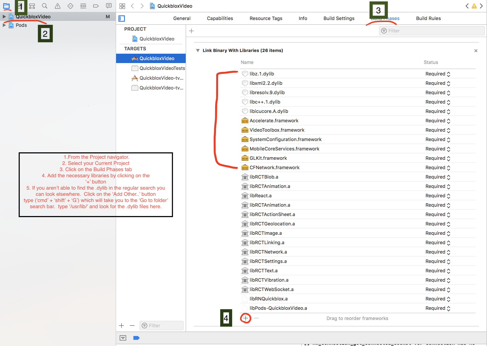

# RN-Quickblox

## Android Installation

### Steps

cd into `ios/` and add a `Podfile` with to install Quickblox and Mantle

```
source 'https://github.com/CocoaPods/Specs.git'
platform :ios, '11.3.3'

target 'QuickbloxVideo' do
pod 'Quickblox-WebRTC', '~> 2.6.1'
pod 'QuickBlox', '~> 2.12'
pod 'Mantle', '~> 2.1.0'
end
```

you are setting the ios version and the name of your project as well.  In this case I'm using
`:ios, '11.3.3'` and my project's name is called `QuickbloxVideo`

save it and run `pod install`
This should generate `Podfile.lock` a `Pods/` folder and most importantly a `[nameOfYourProjectHere].xcworkspace`.

### Be sure that you open and build from the .xcworkspace.

After having opened your `.xcworkspace` in xcode:
1. Go to the project navigator
2. Click on the project folder
3. On the right side locate the **Build Phases** tab.
4. Install the following libraries by clicking on the **+** button.

```
libicucore.dylib
libc++.dylib
libresolv.dylib
libxml2.dylib
libz.dylib
CFNetwork.framework
GLKit.framework
MobileCoreServices.framework
SystemConfiguration.framework
VideoToolbox.framework
Accelerate.framework
```



5. If you aren't able to find the .dylib in the regular search you can look elsewhere.


6. Click on the `Add Other...` button and then type `('CMD' + 'Shift' + 'G')` which will take you to the
`Go to folder` search bar.  Type `/user/lib/` and look fo the `.dylib` files here.


7. Finally you can build the project by simply clicking on the 'Play' button located at the top left hand side
of the xcode project window.


